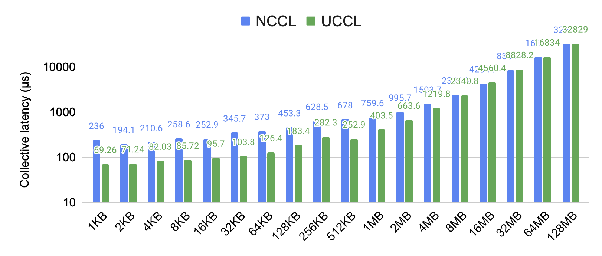
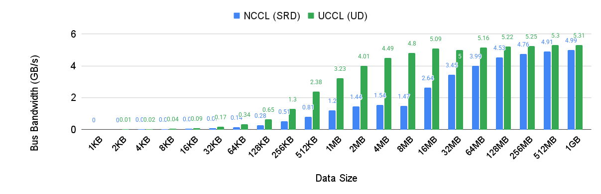

<div align="center">

# UCCL

<p align="center">
    <a href="#about"><b>About</b></a> | 
    <a href="#getting-started"><b>Getting Started</b></a> | 
    <a href="#development-guide"><b>Development Guide</b></a> | 
    <a href="#acknowledgement"><b>Acknowledgement</b></a>
</p>

</div>

## About 

UCCL is an efficient collective communication library for GPUs. 

Existing network transports under NCCL (i.e., kernel TCP and RDMA) leverage one or few network paths to stream huge data volumes, thus prone to congestion happening in datacenter networks. Instead, UCCL employs packet spraying in software to leverage abundant network paths to avoid "single-path-of-congestion". With this design, UCCL provides the following benefits: 
* Faster collectives by leveraging multi-path
* Widely available in the public cloud by leveraging legacy NICs and Ethernet fabric
* Evolvable transport designs including multi-path load balancing and congestion control
* Open-source research platform for ML collectives

On two AWS `g4dn.8xlarge` instances with 50G NICs and T4 GPUs under the cluster placement group, UCCL outperforms NCCL by up to **3.7x** for AllReduce: 



On four AWS `p4d.24xlarge` instances with 4x100G NICs and 8xA100 GPUs, UCCL outperforms NCCL by up to **3.3x** for AlltoAll: 



Free free to checkout our full [technical report](https://arxiv.org/pdf/2504.17307).

## UCCL Dev Agenda

- [] Dynamic membership with node joining and exiting
- [] GPU-initiated network P2P that support generic NIC vendors (eg, Nvidia, EFA, Broadcom)
    - [] For MoE all-to-all and PD separation
- [] NCCL re-architecturing
    - [] Scalable and effcient CPU proxy
    - [] Low-cost async collectives with ordering guarantee
    - [] Device kernel in vendor-agnostic Triton


## Getting Started

Let's first prepare dependencies for UCCL. 
* `git clone https://github.com/uccl-project/uccl.git`
* `export UCCL_HOME=$(pwd)/uccl`
* Install dependency: 
    ```
    sudo apt update
    sudo apt install clang llvm libelf-dev libpcap-dev build-essential libc6-dev-i386 linux-tools-$(uname -r) libgoogle-glog-dev libgtest-dev byobu net-tools iperf iperf3 libgtest-dev cmake m4 libopenmpi-dev libibverbs-dev libpci-dev -y

    # Install and activate Anaconda (you can choose any recent versions)
    wget https://repo.anaconda.com/archive/Anaconda3-2024.10-1-Linux-x86_64.sh
    bash ./Anaconda3-2024.10-1-Linux-x86_64.sh -b
    source ~/anaconda3/bin/activate
    source ~/.bashrc
    conda init

    # Install dependency into default base env
    conda install paramiko -y
    ```
* Init UCCL submodules and build UCCL basic libs
    ```
    cd $UCCL_HOME
    git submodule update --init
    ```

Then you can dive into individual folders for various supports: 
* [`efa/`](./efa/): AWS EFA NIC (currently support p4d.24xlarge)
* [`afxdp/`](./afxdp/): Non-RDMA NICs (currently support AWS ENA NICs and IBM VirtIO NICs)
* [`rdma_cuda/`](./rdma_cuda/): Nvidia/Mellanox GPUs + RDMA NICs (both IB and RoCE)
* [`rdma_hip/`](./rdma_hip/): AMD GPUs + RDMA NICs (both IB and RoCE)

## Documentation

Please refer to [./doc/README.md](doc/README.md) for full documentation.

## Acknowledgement

UCCL is being actively developed at [UC Berkeley Sky Computing Lab](https://sky.cs.berkeley.edu/). We welcome open-source developers. 
