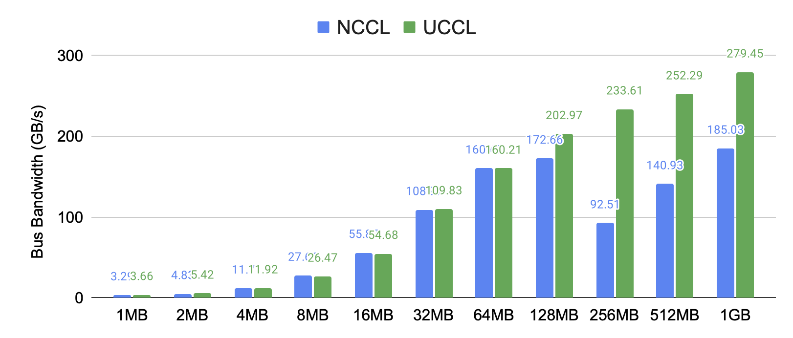
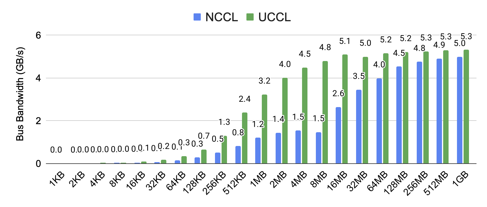
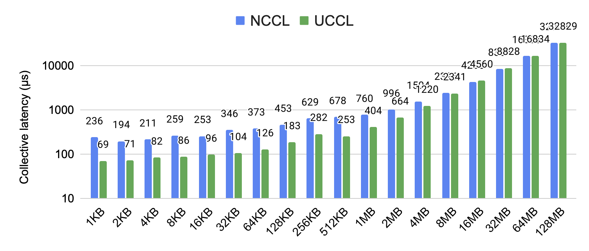

<div align="center">

# UCCL

[](https://uccl-project.github.io/) [](https://github.com/uccl-project/uccl) [](https://x.com/uccl_proj)
<p align="center">
    <a href="#about"><b>About</b></a> | 
    <a href="#road-map"><b>Road Map</b></a> | 
    <a href="#quick-start"><b>Quick Start</b></a> | 
    <a href="#dev-guide"><b>Dev Guide</b></a> | 
    <a href="#acknowledgement"><b>Acknowledgement</b></a> |
    <a href="#contact"><b>Contact</b></a>
</p>

</div>

## About 

UCCL is an efficient collective communication library for GPUs, focusing on: 
* **Flexibility** for high performance in fast-evolving ML workloads
* **Portability** for connecting heterogeneous GPUs in ML workloads

UCCL serves as a drop-in replacement for NCCL/RCCL (e.g., requiring no changes to your PyTorch code), and significantly outperforms them in both latency and throughput across various settings. 

* On six HGX servers (across two racks) with 8x400G CX-7 RoCE NICs and 8xH100 GPUs, UCCL outperforms NCCL by up to **2.5x** for AllReduce:
  <p align="left">  </p>

* On four AWS `p4d.24xlarge` instances with 4x100G EFA NICs and 8xA100 GPUs, UCCL outperforms NCCL by up to **3.3x** for AlltoAll: 
  <p align="left">  </p>

* On two AWS `g4dn.8xlarge` instances with 1x50G ENA NICs and 1xT4 GPUs under the same cluster placement group, UCCL outperforms NCCL by up to **3.7x** for AllReduce: 
  <p align="left">  </p>


More specifically, UCCL aims to: 
* rearchitect the CCL layer (while keeping NCCL APIs) to unleash the full potential of network hardware
* rearchitect the network transport layer to be fast and extensible
* support heterogeneous GPU and networking vendors such as Nvidia, AMD, and Broadcom
* become an open and collaborative platform for GPU communication research

UCCL has built a fast and extensible transport layer in software, which has created many benefits. 
For example, existing network transports under NCCL (i.e., kernel TCP and RDMA) leverage one or few network paths to stream huge data volumes, thus prone to congestion happening in datacenter networks. 
Instead, UCCL employs packet spraying in software to leverage abundant network paths to avoid "single-path-of-congestion". 
More benefits include: 1) packet spraying with 256 paths, 2) advanced congestion control such as latency-based and receiver-driven ones, 3) efficient loss recovery by selective repeat, and 4) widely usable in public clouds with legacy NICs and Ethernet. 

Feel free to check out our full [technical report](https://arxiv.org/pdf/2504.17307) and [slides](https://drive.google.com/file/d/1YsgMNPeCV797sYPiCWAT0AMfc0WgIhP0/view?usp=sharing).

## Road Map

More UCCL features are under development in this repo, currently including: 
- [ ] Dynamic membership with GPU servers joining and exiting
- [ ] More efficient KV cache transfer engine (e.g., better Mooncake)
- [ ] Generic and SM-free GPU-initiated P2P (e.g., better DeepEP for MoE)
  - [ ] Supporting all NIC vendors including Nvidia, AWS EFA, and Broadcom
  - [ ] Avoiding burning precious GPU SMs
- [ ] Re-architecting NCCL to unleash network hardware performance
  - [ ] Scalable and efficient CPU proxy
  - [ ] Fast async collectives with compute-communication ordering guarantee
  - [ ] Device kernels in vendor-agnostic Triton language


## Quick Start

The easiest way to use UCCL is to first: 
```bash
pip install uccl
```

Then, when running your PyTorch applications, set the environment variable accordingly: 
```bash
# NCCL over IB/RoCE on x86 or GH200 ARM hosts
NCCL_NET_PLUGIN=`python -c "import uccl; print(uccl.nccl_plugin_path())"`

# RCCL over IB/RoCE on x86 hosts
NCCL_NET_PLUGIN=`python -c "import uccl; print(uccl.rccl_plugin_path())"`

# NCCL over AWS EFA NICs (p4d and p4de only)
LD_PRELOAD=`python -c "import uccl; print(uccl.efa_nccl_path())"`
NCCL_NET_PLUGIN=`python -c "import uccl; print(uccl.efa_plugin_path())"`
```

Now, you can just run your PyTorch applications and enjoy UCCL performance benefits! 

## Dev Guide

Please refer to [doc/dev.md](doc/dev.md) for full development guide of UCCL.

## Citation
The code in this repository is mostly described in the paper below. Please consider citing this work if you find the repository helpful. 

```bibtex
@article{uccl_transport,
  title={An Extensible Software Transport Layer for GPU Networking},
  author={Zhou, Yang and Chen, Zhongjie and Mao, Ziming and Lao, ChonLam and Yang, Shuo and Kannan, Pravein Govindan and Gao, Jiaqi and Zhao, Yilong and Wu, Yongji and You, Kaichao and others},
  journal={arXiv preprint arXiv:2504.17307},
  year={2025}
}
```

## Acknowledgement

UCCL is being actively developed at [UC Berkeley Sky Computing Lab](https://sky.cs.berkeley.edu/). We welcome open-source developers. 

## Contact
Feel free to raise issues or contact us if you have any questions or suggestions. You can reach us at: 
* Yang Zhou (yangzhou.rpc@gmail.com)
* Zhongjie Chen (chenzhjthu@gmail.com)
* Ziming Mao (ziming.mao@berkeley.edu)
