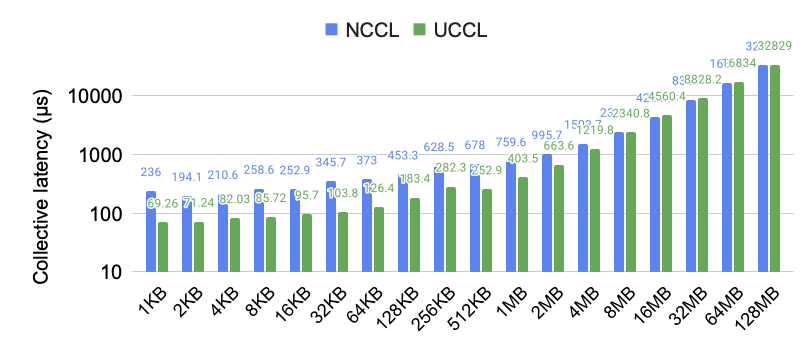

<div align="center">

# UCCL

<p align="center">
    <a href="#about"><b>About</b></a> | 
    <a href="#getting-started"><b>Getting Started</b></a> | 
    <a href="#development-guide"><b>Development Guide</b></a> | 
    <a href="#acknowledgement"><b>Acknowledgement</b></a>
</p>

</div>

## About 

UCCL is an efficient collective communication library for GPUs. 

Existing network transports, i.e., kernel TCP and RDMA, under NCCL leverage one or few network paths to stream huge data volumes, thus prone to congestion happening in datacenter networks. Instead, UCCL employss packet sparying in software to leverage abundant network paths to avoid "single-path-of-congestion". With this design, UCCL provides the following benefits: 
* Faster collectives by leveraging multi-path
* Widely available in the public cloud by leveraging legacy NICs and Ethernet fabric
* Evolvable transport designs including multi-path load balancing and congestion control
* Open-source research platform for ML collectives

On two AWS `g4dn.8xlarge` instanaces with 50G NICs and T4 GPUs under the cluster placement group, UCCL outperform NCCL by up to **3.7x** for AllReduce: 



## Getting Started

UCCL currently supports AWS ENA NICs; support for Azure and GCP NICs and RDMA is on the way. It is implemented as a NCCL plugin library with drop-in replacement for NCCL applications. Here, we show how to run the standard `nccl-tests` that leverages UCCL atop two AWS `g4dn.8xlarge` instanaces with T4 GPUs. 

1. Create two `g4dn.8xlarge` instanaces each with a second ENA NIC interface and a public IP: 
    * Login to EC2 console `us-east-1` and click `Launch instances`
    * Enter `Name and tags`
    * Select AMI of `Deep Learning OSS Nvidia Driver AMI GPU PyTorch 2.5 (Ubuntu 22.04)` or latest version
        * Alternatively, we have prepared an AMI (`ami-07f7062a5d995d7c4`) to simplify dependency setup in step 2
    * Select `g4dn.8xlarge` for `instances types` and choose your own `Key pair`
    * Click `Edit` for `Networking settings`, then select a random subnet and disable `Auto-assign public IP`
    * Click `Advanced network configuration`, then click `Add network interface`
    * Configure security rules to allow any traffic goes through the instances
    * Under `Summary`, enter 2 for `Number of instances`
    * Click `Launch instance`
    * Back to the EC2 console page, click `Elastic IPs` then `Allocate Elastic IP address` to allocate two public IPs
    * Back to the `Elastic IPs` page, for each public IP, right click the it to `Associate Elastic IP address`
        * Click `Network interface`, then enter the first network interface ID of each VM
        * Click `Allow this Elastic IP address to be reassociated` then `Associate`
    * Now you should be able to login to `VM1` and `VM2` via ssh over public IPs
    * Also configure necessary ssh keys to make sure `VM1` can ssh `VM2` with password

2. Configure the two VM instances for UCCL tests as follows. Note if you have use our provided AMI, you can skip this setp.
    <details><summary>Click me</summary>
    
    * Build `uccl` under the `/opt` folder:
        * `sudo chown ubuntu:ubuntu /opt && cd /opt`
        * `git clone https://github.com/uccl-project/uccl.git && cd uccl`
        * Install dependency: 
            ```
            sudo apt update
            sudo apt install clang llvm libelf-dev libpcap-dev build-essential libc6-dev-i386 linux-tools-$(uname -r) libgoogle-glog-dev libgtest-dev byobu net-tools iperf iperf3 libgtest-dev cmake -y

             # re-login to use conda
            ./setup_extra.sh
            conda activate && conda install paramiko -y

            # ignore "config.h: No such file or directory" in the end
            make
            ```
        * Update AWS ENA driver to support zero-copy AF_XDP
            ```
            # Install last ena driver with reboot persistent
            sudo apt-get install dkms
            git clone https://github.com/amzn/amzn-drivers.git -b ena_linux_2.13.0
            sudo mv amzn-drivers /usr/src/amzn-drivers-2.13.0
            sudo vi /usr/src/amzn-drivers-2.13.0/dkms.conf

            # Paste the following and save the file:
            PACKAGE_NAME="ena"
            PACKAGE_VERSION="2.13.0"
            CLEAN="make -C kernel/linux/ena clean"
            MAKE="make -C kernel/linux/ena/ BUILD_KERNEL=${kernelver}"
            BUILT_MODULE_NAME[0]="ena"
            BUILT_MODULE_LOCATION="kernel/linux/ena"
            DEST_MODULE_LOCATION[0]="/updates"
            DEST_MODULE_NAME[0]="ena"
            REMAKE_INITRD="yes"
            AUTOINSTALL="yes"

            sudo dkms add -m amzn-drivers -v 2.13.0
            sudo dkms build -m amzn-drivers -v 2.13.0
            sudo dkms install -m amzn-drivers -v 2.13.0
            sudo modprobe -r ena; sudo modprobe ena
            ```
    * Build `nccl` and `nccl-tests` under the `/opt/uccl` folder:
        ```
        cd nccl
        make src.build -j
        cp src/include/nccl_common.h build/include/
        cd ..

        cd nccl-tests
        make MPI=1 MPI_HOME=/usr/lib/x86_64-linux-gnu/openmpi CUDA_HOME=/usr/local/cuda NCCL_HOME=/opt/uccl/nccl/build -j
        cd ..
        ```
    </details>

3. Run UCCL transport tests on `VM1`:
    * `cd /opt/uccl && git pull`
    * Edit `nodes.txt` to only include the two public IPs of the VMs
    * Build UCCL: 
        * `python setup_all.py --target aws_g4_afxdp`
        * Keep `setup_all.py` running
    * Run UCCL tests: 
        * `cd /opt/uccl/afxdp/`
        * [`VM1`] `./transport_test --logtostderr=1 --clientip=<VM2 ens6 IP> --test=bimq`
        * [`VM2`] `./transport_test --logtostderr=1 --client --serverip=<VM1 ens6 IP> --test=bimq`
        * [`VM2`] You should be able to see something like `Sent 10000 messages, med rtt: 1033 us, tail rtt: 1484 us, link bw 98.3371 Gbps, app bw 95.3775 Gbps`. 

4. Run `nccl-tests` on `VM1`: 
    * `python setup_all.py --target aws_g4_afxdp`
    * `cd /opt/uccl/afxdp/`
    * `./run_nccl_test.sh afxdp 2`
    * You should be able to see `nccl-tests` results. 

## Development Guide

Please refer to [README_dev.md](./README_dev.md) for development setup and testing.

## Acknowledgement

UCCL is being actively developed at [UC Berkeley Sky Computing Lab](https://sky.cs.berkeley.edu/). We welcome contributions from open-source developers. 
