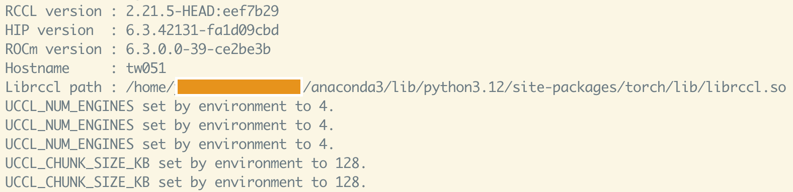

# RDMA-Enabled PyTorch Test Suite

This folder contains lightweight benchmarks that validate **multi-GPU** and **multi-node** communication on AMD Instinct™ clusters using ROCm/RCCL.  Both tests can optionally route traffic through the high-performance **UCCL** RDMA plugin.

---

## File overview

| File | Purpose |
|------|---------|
| `ddp_amd_test.py` | CIFAR-10 training demo (ResNet-18) driven by **DistributedDataParallel**. |
| `ddp_amd_run.sh`  | Launch helper for the training demo. |
| `multi_pg_test.py` | Stress-test that builds three *overlapping* process-groups (BIG, EVEN, ODD) and drives **concurrent** collectives on separate CUDA/HIP streams. |
| `multi_pg_run.sh` | Launch helper for the multi-PG stress test. |

---

## Prerequisites

1. **PyTorch w/ ROCm**.
2. **RCCL** libraries (bundled with ROCm).
3. Optional: **UCCL** build that provides `librccl-net-uccl.so`.
4. `torchvision` (only for `ddp_amd_test.py`).

You can install prerequisite 1, 2, and 4 using the following command line, and build prerequisite 3 following [`rdma/README.md`](../rdma/README.md) 
```bash
pip3 install torch torchvision torchaudio --index-url https://download.pytorch.org/whl/rocm6.3
```

Set the following when using UCCL:
```bash
export UCCL_HOME=<path/to/uccl>            # root of your uccl checkout
export CONDA_LIB_HOME=$CONDA_PREFIX/lib    # contains libglog.so
```

If you see `UCCL_* set by environment to xx` printed, that means you have successfully used UCCL in your PyTorch apps. 
<p align="left">  </p>

---

## 1 · Distributed training demo (`ddp_amd_*`)

### Single-node (4 GPUs)
```bash
./ddp_amd_run.sh nccl single 128 10        # BACKEND MODE BATCH_SIZE EPOCHS
```

### Two-node (4 × 2 GPUs)
```bash
# master node (rank-0)
MASTER_ADDR=10.0.0.1 MASTER_PORT=12355 NODE_RANK=0 WORLD_SIZE=2 \
./ddp_amd_run.sh uccl multi 128 10

# worker node (rank-1)
MASTER_ADDR=10.0.0.1 MASTER_PORT=12355 NODE_RANK=1 WORLD_SIZE=2 \
./ddp_amd_run.sh uccl multi 128 10
```
Arguments (defaults shown):
```bash
./ddp_amd_run.sh [BACKEND] [MODE] [BATCH_SIZE] [EPOCHS]
# BACKEND : nccl | uccl
# MODE    : single|multi
```

---

## 2 · Concurrent collectives demo (`multi_pg_*`)
`multi_pg_test.py` creates four groups in **the same order on every rank**:
```
WORLD  – implicit default group
BIG    – explicit group containing *all* ranks
EVEN   – ranks {0,2,4,…}
ODD    – ranks {1,3,5,…}
```
During each iteration the script:
1. Resets per-rank tensors.
2. Launches **four collectives** on their own HIP streams with `async_op=True`:
   • all-reduce (WORLD)
   • broadcast (EVEN)
   • all-reduce (ODD)
   • all-gather (BIG)
3. Waits for completion, synchronises, then performs a global `barrier()`.

### Single-node (4 GPUs)
```bash
./multi_pg_run.sh nccl single 4 100 4096   # BACKEND MODE GPUS ITER SIZE
```

### Two-node example
```bash
# master node (rank-0)
MASTER_ADDR=10.0.0.1 MASTER_PORT=12355 NODE_RANK=0 WORLD_SIZE=2 \
./multi_pg_run.sh uccl multi 4 100 4096

# worker node (rank-1)
MASTER_ADDR=10.0.0.1 MASTER_PORT=12355 NODE_RANK=0 WORLD_SIZE=2 \
./multi_pg_run.sh uccl multi 4 100 4096
```
Arguments:
```bash
./multi_pg_run.sh [BACKEND] [MODE] [NUM_GPUS] [ITERS] [TENSOR_SIZE]
```

---

## Troubleshooting tips
* Enable verbose logging: `export NCCL_DEBUG=INFO` `GLOG_v=1`.
* Ensure `HIP_VISIBLE_DEVICES` matches GPUs that have RNIC visibility.

Happy benchmarking 🚀
